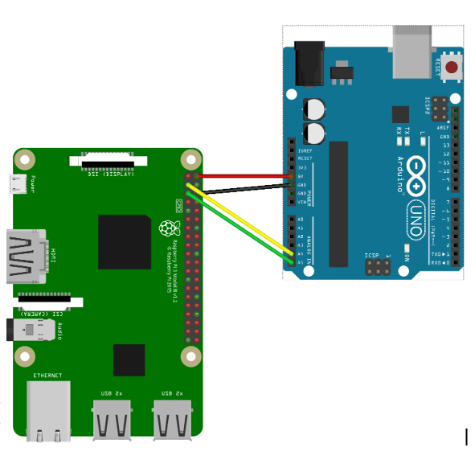

[](https://classroom.github.com/a/yYM1ueh_)
# Sistemas Embebidos

Departamento de Ciencias e Ingeniería de la Computación
Universidad Nacional del Sur
Segundo Cuatrimestre de 2025

## 🚀  Laboratorio Nº4
Este laboratorio se enfoca en la comunicación entre Raspberry Pi y Arduino utilizando el protocolo I2C para obtener mediciones de luminosidad. Se implementa un sistema maestro-esclavo donde Raspberry Pi actúa como maestro y Arduino como esclavo, extendiendo el sistema de medición de luminosidad del Laboratorio 3.

**Fecha de entrega: Viernes 17/10/25**

## Entregables

* Código fuente dentro de `src/`
* Un informe **conciso** (lo mínimo solicitado) y **completo** (lo que necesita
  la cátedra saber sobre el proyecto para compilarlo y cargarlo, y comentarios  adicionales que sean *importantes* sobre la entrega), almacenado en  `doc/informe.md`.
   - especifique la estructura del protocolo utilizado para la actividad 2 y cómo es el diseño del envío desde arduino a la raspberry y desde la raspberry a arduino.
   - cuáles son las modificaciones sobre el laboratorio anterior que considera necesarias. - Añada toda decisión o limitación de diseño que considere relevante.
  


#  📂 Actividad 1: Introducción a Raspberry Pi y Comunicación Básica I2C

1. Conectar la placa Raspberry por Ethernet a la red. Conectar la alimentación y encenderla. Utilizando PuTTY o algún otro cliente, acceda por SSH. Experimente el entorno Linux utilizando comandos estándar como top, ls, cd, etc.
2. Configurar Raspberry Pi para comunicación I2C
3. Descargar de la carpeta `deploy` el ejemplo de software para Raspberry `master_receiver.cpp`, que comunica con I2C a la Raspberry. Analizar el código del ejemplo y familiarizarse  con el uso de la biblioteca pigpio.
4. Conectar Arduino y Raspberry mediante I2C como indica la figura 1. Descargar en Arduino el
ejemplo `slave_send.cpp`, y correr en Raspeberry el ejemplo provisto por la materia `master_receiver`.  Observar la salida por consola provista por `master_receiver`.


```ascii
             ┌─────────────────┐    I2C Bus    ┌─────────────────┐
             │   Raspberry Pi  │ ◄──────────►  │    Arduino      │
             │    (Maestro)    │    SDA/SCL    │   (Esclavo)     │
             │                 │               │                 │
             │ - Aplicación    │               │ - Sensor LDR    │
             │   de consola    │               │ - Mediciones    │
             │ - Control I2C   │               │ - Protocolo     │
             └─────────────────┘               └─────────────────┘
```

<div align="center">
  
  
</div>

## Configuración de Raspberry Pi

### Paso 1: Habilitación del Bus I2C

```bash
# Habilitar I2C en Raspberry Pi
sudo raspi-config
# Navegar: Interfacing Options → I2C → Enable

# Verificar que I2C esté habilitado
lsmod | grep i2c


# Instalar herramientas I2C
sudo apt update
sudo apt install -y i2c-tools python3-smbus python3-dev
```

### Paso 2: Instalación de pigpio

```bash
# Instalar pigpio
sudo apt update
sudo apt install pigpio python3-pigpio

# Habilitar y iniciar daemon pigpio
# sudo systemctl enable pigpiod
# sudo systemctl start pigpiod

# Verificar que el daemon esté corriendo
# sudo systemctl status pigpiod

# Instalar librería Python adicional (opcional, mejor performance)
# pip3 install pigpio
```

### Paso 3: Conexiones Hardware

```
Raspberry Pi          Arduino Uno
GPIO 2 (SDA) ────────── A4 (SDA)
GPIO 3 (SCL) ────────── A5 (SCL)
GND ──────────────────── GND

```

### Paso 4: Compilar en raspberry usando la librería pigpio

```bash
g++ -o master_receiver master_receiver.cpp -lpigpio -lpthread -lrt 
```
# 📂  Actividad 2: Mediciones de luminosidad por I2C

Se desea obtener desde Raspberry, las medidas de luminosidad provistas por el sistema implementado en el Laboratorio 3. Para la comunicación entre ambas placas, se utilizará el bus I2C. La placa Raspberry actuará como maestro en la comunicación, y la placa Arduino como esclavo. Raspberry podrá solicitar a Arduino la luminosidad actual, la máxima, la mínima o la promedio calculada hasta el momento.

1. Diseñar en papel, o utilizando herramientas electrónicas de dibujo o procesamiento de textos, el protocolo que realizará la comunicación entre Arduino y Raspberry. Este protocolo debe:

<div align="justify">

Arme un paquete de comunicación que incluya los siguientes campos:

- **Símbolo de comienzo**: Un byte especial (por ejemplo, `0x7E`) que indica el inicio del paquete.
- **Tamaño total**: Un campo de un byte que especifica el tamaño total del mensaje, incluyendo todos los campos.
- **Tipo de mensaje**: Un byte que identifica el tipo de mensaje (por ejemplo, `OBTENER_LUX`, `OBTENER_MAX`, `OBTENER_MIN`, `OBTENER_PROM`, `OBTENER_TODO`, `RESPONDER_LUX`, `RESPONDER_MAX`, `RESPONDER_MIN`, `RESPONDER_PROM`, `RESPONDER_TODO`). Se pueden agregar otros tipos si es necesario.
- **Payload**: Un campo de tamaño variable (puede ser de tamaño cero) que contiene los datos asociados al mensaje.
- **Símbolo de fin**: Un byte especial (por ejemplo, `0x7F`) que indica el final del paquete.

Para evitar confusiones cuando los símbolos de comienzo o fin aparecen dentro del payload, defina un **símbolo de escape** (por ejemplo, `0x7D`). Si alguno de los bytes reservados (`0x7E`, `0x7F`, `0x7D`) aparece en el payload, debe ser precedido por el símbolo de escape y, opcionalmente, modificado (por ejemplo, XOR con un valor fijo).

El formato general del paquete es:

```
[START][SIZE][TYPE][PAYLOAD][END]
```

Donde:

- `START`: Byte de inicio (`0x7E`)
- `SIZE`: Tamaño total del mensaje (1 byte)
- `TYPE`: Tipo de mensaje (1 byte)
- `PAYLOAD`: Datos variables (0-N bytes, con escape si es necesario)
- `END`: Byte de fin (`0x7F`)

Este diseño permite transmitir mensajes de longitud variable de manera robusta y segura, facilitando la detección de errores y la expansión futura del protocolo.

</div>


2. ¿Qué beneficios tiene indicar el comienzo y el fin de un mensaje? ¿Por qué es necesario un símbolo especial de escape?

3. Modificar el sistema para Arduino desarrollado en el Laboratorio 3, para que funcionando como esclavo del bus I2C, con un ID de I2C igual al que tiene la placa Arduino utilizada, reciba los mensajes OBTENER_LUX, OBTENER_MAX, OBTENER_MIN, OBTENER_PROM, OBTENER_TODO, y responda respectivamente con los mensajes RESPONDER_LUX, conteniendo la información de luminosidad actual; RESPONDER_MAX y RESPONDER_MIN, conteniendo la información de luminosidad máxima y mínima registradas; RESPONDER_PROM, con la luminosidad promedio; y RESPONDER_TODO, que contiene luminosidad actual, mínima, máxima y promedio.

4. Escribir un programa en el entorno Visual Studio Code para la placa Raspberry, que se comunique  como maestro por I2C con Arduino. Este programa debe funcionar como programa de consola.  Debe aceptar opciones en la línea de comandos parar solicitar la luminosidad actual, luminosidad máxima y mínima, y luminosidad promedio a Arduino. Una vez recibida la respuesta de Arduino, debe mostrarla por la salida estándar de la consola. 

5. Suponiendo que el sistema ejecutando en Arduino no necesite mostrar por pantalla datos de luminosidad ¿Es conveniente que Arduino envíe la información en luminosidad, o quizá otra medida, como los ticks de ADC? Justificar.

- [Referencias y recursos](referencias.md)


<!--
## Objetivos Generales

- Comprender la arquitectura y configuración básica de Raspberry Pi
- Implementar comunicación I2C entre Raspberry Pi y Arduino
- Diseñar un protocolo de comunicación robusto con escape de caracteres
- Desarrollar sistema maestro-esclavo para adquisición de datos de sensores
- Crear aplicación de consola en Raspberry Pi para control remoto
- Integrar el sistema de medición de luminosidad del Laboratorio 3

## Hardware Utilizado

- **Raspberry Pi** (3B+ o 4B recomendado)
- **Arduino Uno** con sistema de luminosidad del Lab 3
- **Sensor de luminosidad** (LDR o sensor digital)
- **Conexiones I2C** (SDA/SCL)
- **Resistencias pull-up** (4.7kΩ) para I2C

## Arquitectura del Sistema

```ascii
┌─────────────────┐    I2C Bus     ┌─────────────────┐
│   Raspberry Pi  │ ◄──────────► │    Arduino      │
│    (Maestro)    │    SDA/SCL    │   (Esclavo)     │
│                 │               │                 │
│ - Aplicación    │               │ - Sensor LDR    │
│   de consola    │               │ - Mediciones    │
│ - Control I2C   │               │ - Protocolo     │
└─────────────────┘               └─────────────────┘
```

## Protocolo de Comunicación

### Tipos de Mensajes Soportados

**Comandos (Raspberry → Arduino):**
- `OBTENER_LUX`: Solicitar luminosidad actual
- `OBTENER_MAX`: Solicitar luminosidad máxima registrada
- `OBTENER_MIN`: Solicitar luminosidad mínima registrada
- `OBTENER_PROM`: Solicitar luminosidad promedio
- `OBTENER_TODO`: Solicitar todos los valores

**Respuestas (Arduino → Raspberry):**
- `RESPONDER_LUX`: Enviar luminosidad actual
- `RESPONDER_MAX`: Enviar luminosidad máxima
- `RESPONDER_MIN`: Enviar luminosidad mínima
- `RESPONDER_PROM`: Enviar luminosidad promedio
- `RESPONDER_TODO`: Enviar todos los valores

### Formato del Paquete

```
[START][SIZE][TYPE][PAYLOAD][END]
```

- **START**: Byte de inicio (0x7E)
- **SIZE**: Tamaño total del mensaje (1 byte)
- **TYPE**: Tipo de mensaje (1 byte)
- **PAYLOAD**: Datos variables (0-N bytes)
- **END**: Byte de fin (0x7F)

### Características del Protocolo

- **Escape de caracteres**: Símbolos especiales para evitar confusión
- **Detección de errores**: Validación de integridad de mensajes
- **Flexibilidad**: Payload de tamaño variable
- **Robustez**: Manejo de errores de comunicación
-->

## 🔥  Funcionalidades del Sistema

#### Lado Arduino (Esclavo)

1. **Gestión de sensores**: Lectura continua de luminosidad
2. **Estadísticas**: Cálculo de máximo, mínimo y promedio
3. **Protocolo I2C**: Respuesta a comandos del maestro
4. **Buffers**: Manejo de datos de transmisión/recepción

#### Lado Raspberry Pi (Maestro)

1. **Aplicación de consola**: Interface de línea de comandos
2. **Control I2C**: Comunicación con Arduino
3. **Parsing de comandos**: Interpretación de argumentos
4. **Visualización**: Mostrar resultados formateados


#### Ventajas del Sistema I2C

1. **Eficiencia**: Solo 2 cables para comunicación multi-dispositivo
2. **Flexibilidad**: Múltiples esclavos en el mismo bus
3. **Robustez**: Protocolo bien establecido con detección de errores
4. **Velocidad**: Hasta 400kHz en modo fast
5. **Simplicidad**: Hardware mínimo requerido


## Aplicaciones Prácticas

Este sistema puede extenderse para:

- **Monitoreo ambiental**: Múltiples sensores distribuidos
- **Control domótico**: Automatización basada en luminosidad
- **Data logging**: Registro histórico de mediciones
- **Alertas**: Notificaciones por condiciones ambientales
- **Web interface**: Acceso remoto via navegador


