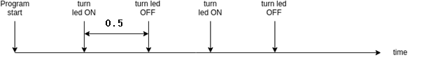

[](https://classroom.github.com/a/aOdkt2_h)
# Sistemas Embebidos

Departamento de Ciencias e Ingeniería de la Computación
Universidad Nacional del Sur
Segundo Cuatrimestre de 2025

## 🚀  Laboratorio Nº5
Este laboratorio introduce los conceptos fundamentales de los sistemas operativos de tiempo real (RTOS) utilizando FreeRTOS en microcontroladores Arduino. Se exploran las tareas concurrentes, estados de tareas, timers de software y gestión de recursos en sistemas embebidos de tiempo real.

**Fecha de entrega: Viernes 27/10/2025

## Entregables

* Código fuente dentro de `src/`
* Un informe **conciso** (lo mínimo solicitado) y **completo** (lo que necesita
  la cátedra saber sobre el proyecto para compilarlo y cargarlo, y comentarios  adicionales que sean *importantes* sobre la entrega), almacenado en  `doc/informe.md`.
    - especifique las tareas y el método utilizado para sincronizar las tareas de la actividad 1.
    - especifique las funciones de callback de cada uno de los timers y la ventaja de utilizar  timers de software en la actividad 2. Añada toda decisión o limitación de diseño que  considere relevante.


#  📂 Actividad 1: Introducción a FreeRTOS


Desarrolle un programa utilizando el kernel FreeRTOS [1] y PlatformIO para controlar el parpadeo de un LED a una frecuencia de 1 Hz, como se muestra en la Figura 1. Implemente el parpadeo mediante dos tareas: una encargada de encender el LED y otra de apagarlo. Analice y describa los posibles estados de una tarea en FreeRTOS (ver Figura 2).

<p align="center">
  
</p>

```
FIGURA 1: Sistema de Parpadeo LED con FreeRTOS (1 Hz)

Circuito:
                    +5V
                     |
    Arduino         [R] 220Ω
    Pin 13 -------- [LED] -------- GND
                     |
                    \/

Diagrama Temporal (1 Hz = 1000ms período):
    LED State:  ON     OFF     ON     OFF     ON
                |-------|-------|-------|-------|
    Time (ms):  0     500    1000   1500   2000

Tareas FreeRTOS:

    ┌─────────────────┐         ┌─────────────────┐
    │   TASK_LED_ON   │◄──────► │  TASK_LED_OFF   │
    │                 │         │                 │
    │ - Enciende LED  │         │ - Apaga LED     │
    │ - Delay 500ms   │         │ - Delay 500ms   │
    │ - Señaliza OFF  │         │ - Señaliza ON   │
    └─────────────────┘         └─────────────────┘
             │                           ▲
             └───── Sincronización ──────┘
                    (Semáforo/Queue)

Estados de Tarea FreeRTOS:

         ┌─────────────┐
         │   RUNNING   │◄─── Scheduler activo
         └──────┬──────┘
                │
    ┌───────────▼──────────┐
    │      READY           │◄─── Esperando CPU
    └───────────┬──────────┘
                │
    ┌───────────▼──────────┐
    │     BLOCKED          │◄─── vTaskDelay(), 
    │   (DELAYED/WAITING)  │     Semáforos, etc.
    └──────────────────────┘

Flujo de Ejecución:
    
    Tiempo: 0ms     500ms    1000ms   1500ms   2000ms
            │         │        │        │        │
    Task1:  [RUN]───[BLOCK]──[RUN]───[BLOCK]──[RUN]...
    Task2:  [BLOCK]──[RUN]───[BLOCK]──[RUN]───[BLOCK]...
    LED:     ON      OFF      ON       OFF      ON
```

```bash
¿Cómo podría extenderse el sistema para controlar más de dos LEDs con distintas frecuencias sin saturar la CPU?
```

# 📂  Actividad 2: Timers de software 

Construya un circuito con dos leds conectados a las salidas digitales de Arduino e implemente un programa que utilizando el módulo timers.h de FreeRTOS [1], inicie dos timers de software [2], uno asociado a cada LED. Un timer provoca toggle de su LED a una frecuencia de 4Hz y el segundo a una frecuencia de 1Hz. Este último deberá poder cambiar su modo de operacion según un número leído desde la entrada serie: (1) titilar a 0.5 HZ y (2) titilar a 2HZ.


```bash
Cada timer debe contar con su propia función callback asociada en la creación.
¿Cuál es la ventaja de utilizar timers de software con respecto a la actividad 1.?
```


## Beneficios del Enfoque RTOS

### Ventajas sobre Programación Secuencial
1. **Concurrencia real**: Múltiples tareas simultáneas
2. **Determinismo**: Comportamiento temporal predecible
3. **Modularidad**: Separación clara de funcionalidades
4. **Escalabilidad**: Fácil adición de nuevas tareas
5. **Mantenibilidad**: Código más estructurado y debuggeable

### Casos de Uso Prácticos
- **Sistemas de control**: Múltiples sensores y actuadores
- **Comunicaciones**: Protocolos simultáneos
- **Interfaces de usuario**: Respuesta independiente
- **Monitoreo**: Logging y alertas en background
- **IoT**: Conectividad y procesamiento local


