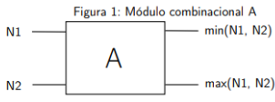

### Sistemas Embebidos

Departamento de Ciencias e Ingeniería de la Computación
Universidad Nacional del Sur
Segundo Cuatrimestre de 2025

## 🚀  Laboratorio Nº6

Este laboratorio introduce el diseño de hardware programable utilizando dispositivos FPGA (Field-Programmable Gate Array) con las herramientas de desarrollo Quartus Prime de Intel/Altera. Los estudiantes aprenderán a implementar circuitos digitales en Verilog, integrar módulos IP, y desarrollar sistemas completos utilizando procesadores soft-core.

Fecha de evaluación: Lunes 10/11/25

### Entregables

* Código fuente dentro de `src/`
* Un informe **conciso** (lo mínimo solicitado) y **completo** (lo que necesita
  la cátedra saber sobre el proyecto para compilarlo y cargarlo, y comentarios  adicionales que sean *importantes* sobre la entrega), almacenado en  `doc/informe.md`.

### Actividad 1: Integración de módulos de hardware programable.

Durante esta actividad introductoria del conjunto de herramientas de desarrollo Quartus Prime de Altera, se pretende programar un elemento de hardware sencillo en el FPGA, para poder probar el circuito utilizando las facilidades de E/S de la placa Altera DE1-SoC. Además de los módulos brindados por la cátedra, se pretende la integración de un IP (Intellectual Property) sencillo disponible en el entorno. La actividad se realizará en lenguaje Verilog.

1. Analice el ejemplo brindado por la cátedra [3] y determine los periféricos de la Placa Altera DE1-SoC utilizados.
2. En base al punto anterior, configure un proyecto con la herramienta DE1SoC_SystemBuilder.exe[2], disponible con la distribución de la placa.
3. Ejecute el entorno Quartus Prime y familiarícese con los principales componentes y opciones.
Utilizando Quartus Prime, abra el proyecto generado en el punto anterior. Copie y pegue la lógica del ejemplo Actividad1.v, en el módulo top level del proyecto. Luego, integre al proyecto  el archivo Temporizador.v [3].
4. Genere un módulo denominado Multiplexor, compatible con la instanciación realizada en el
módulo top level, a partir de una variación de la IP de librería LPM_MUX (IP Catalog > Library > Basic Functions > Miscellaneous)    para multiplexar entre dos datos de 4 bits cada uno.
5. Examine la asignación de pines realizada por la herramienta en el punto 2.
6. Sintetice el diseño.
7. Examine el resultado de la síntesis mediante los visores de netlists (accesibles desde Tools > Netlist Viewers). Use el RTL Viewer al completar el análisis y síntesis, y los Technology Map Viewers al completar las etapas de mapeo, posicionamiento y ruteo (Mapping and Fitting). Con el diseño ya posicionado, utilice el Chip Planner (Tools > Chip Planner) para examinar la disposición final del  sistema en el FPGA.
8. Analice cada una de las etapas realizadas, las tareas llevadas a cabo por el ambiente de desarrollo durante la compilación del diseño, los archivos que se utilizan y se generan, y la relación existente con los distintos niveles de abstracción vistos en teoría, y que son provistos por los Lenguajes de Descripción de Hardware.
9. Descargue el bitstream generado usando el programador en modo JTAG ¿Qué diferencias encuentra al programar el FPGA de esta manera en lugar de hacerlo en modo Active (quad) Serial usando el dispositivo de con figuración EPCS128? ¿En qué escenarios es más adecuado el uso de cada una de estas alternativas?
10. Pruebe el circuito programado.

### Actividad 2: Desarrollo de módulos de hardware programable
Se desea implementar  un sistema digital capaz de capturar, ordenar y visualizar 4 valores de 8 bits, utilizando estructuras secuenciales (latches, contadores) y combinacionales (comparadores, multiplexores, decodificadores BCD–HEX).

1. Configure un proyecto mediante la utilidad DE1SoC_SystemBuilder.exe con llaves, pulsadores,  LEDs y displays de 7 segmentos.
2. Siguiendo la figura 1, especifique en Verilog un módulo combinacional (denominado A), que ordene 2 datos numéricos. Para ello deberá contar con dos entradas, N1 y N2, y dos salidas, S1 y S2, de 8 bits cada una. Deberá emitir la menor de las entradas por la salida S1, y la mayor de las entradas por la salida S2.

    

3. A partir de lo realizado en el punto anterior, implemente un módulo combinacional (denominado Sorter4) que utilizando el módulo A, permita realizar el ordenamiento, tomando 4 entradas numéricas de 8 bits. 
4. Implemente un circuito decodificador combinacional, que permita representar el resultado del multiplexor MS, utilizando los displays de 7 segmentos HEX0 (unidades), HEX1 (decenas) y HEX (centenas). Para ello defina un módulo BCD2HEX que permita representar los dígitos en un display individual, a partir de recibir como entrada un dígito BCD, y con dicho módulo instanciado 3 veces y el decodificador Binario a BCD, implemente el decodificador combinacional completo. 
Tenga en cuenta que los segmentos de los displays se encienden cuando la línea de control asociada toma un valor lógico bajo [1].
5. Sintetice el diseño y verifique el mismo examinando las NetLists generadas.
6. Descargue el diseño y pruebe el sistema.

⚙️ Descripción funcional

Carga de datos:
Cada vez que se presiona una tecla (**`KEY0`**), el sistema almacena el valor de las llaves (**`SW[7:0]`**) en uno de los 4 registros (**`val0`**–**`val3`**). Un contador (**`count_load`**) determina en qué registro se guarda el siguiente valor.

Ordenamiento:
Los 4 valores capturados se envían al módulo **`sort4`**, que aplica una red de **comparadores y operaciones de intercambio** para ordenar los valores (de menor a mayor o viceversa). Se utilizan módulos de comparación e intercambio entre pares, replicados o en etapas secuenciales según la arquitectura del sorter.

Visualización:
Al presionar **`KEY1`**, un contador (**`sel_out`**) selecciona cuál de los 4 valores ordenados se mostrará. Un **multiplexor** selecciona uno de los valores ordenados. Un conversor **`BinaryToBCD`** y módulos **`BCD2HEX`** permiten visualizar el valor en los displays (HEX), usando los módulos BCD2HEX instanciados para cada dígito a mostrar.

El circuito actual permite ordenar 4 valores de 8 bits utilizando comparadores combinacionales en paralelo.
**¿Cómo debería modificarse la arquitectura para ordenar 8 valores de 8 bits?**

- ¿Cuántos comparadores (módulos A) serían necesarios?

- ¿Cuántas etapas (niveles) tendría la red de ordenamiento?

- ¿Qué ventajas e inconvenientes tendría replicar el hardware frente a reutilizarlo en distintos ciclos de reloj?

- ¿Podría aplicarse una estructura tipo butterfly (red de comparadores en paralelo) como la vista en la actividad anterior?

- ¿Qué módulos adicionales serían necesarios para cargar y mostrar 8 valores en pantalla?

### Actividad 3: Una aplicación sencilla sobre procesadores soft-core

En esta actividad se pretende especificar en Verilog un sistema completo compuesto por un procesador, memoria y dispositivos simples de entrada/salida. Los puntos a desarrollar permitirán integrar una solución de hardware y software para un sistema sencillo sobre el procesador soft‑core Nios II Gen2 de Altera.

1. Configure un proyecto con la herramienta DE1SoC_SystemBuilder.exe contemplando el uso de clock, pulsadores, llaves y LEDs. Abra el proyecto en Quartus Prime y familiarícese con la herramienta Platform Designer (ex‑Qsys).
2. Integre un sistema SoPC compuesto por: módulo de clock a 50 MHz, procesador Nios II Gen2, memoria on‑chip, un puerto PIO de entrada, un puerto PIO de salida, una unidad JTAG UART y un System ID Peripheral. Conecte los componentes, defina el mapa de memoria e interrupciones y genere el sistema.
3. En Quartus Prime, instancie el SoPC conectando CLOCK_50 al clock, KEY[0] al reset, LEDR[7:0] al puerto de salida y SW[7:0] al puerto de entrada.
4. Sintetice el diseño y verifique las netlists generadas.
5. Abra Nios II Software Build Tools for Eclipse y cree una nueva aplicación usando “Nios II Application and BSP from template” a partir del template Hello World, referenciando el archivo .sopcinfo generado.
6. Configure y genere el BSP para el sistema.
7. Añada o copie el código del ejemplo propuesto por la cátedra [4] en el archivo principal de la aplicación y construya el proyecto completo.
8. Con el programador de Quartus Prime descargue el SoPC programado al FPGA.
9. En Nios II SBT for Eclipse, cree una Run Configuration para target Nios II, establezca la conexión con el SoPC en el FPGA y descargue el firmware. Compruebe el funcionamiento del sistema.
10. Compare el código utilizado con el ejemplo nohal.c [5]: identifique diferencias, ventajas y desventajas de ambos enfoques y justifique sus observaciones.
11. Describa el proceso de desarrollo con un SoC implementado sobre un procesador soft‑core y explique las ventajas que ofrece este esquema para introducir cambios y futuras modificaciones en el diseño.

### Referencias

[1] DE1-SoC User Manual. Terasic Technologies Inc.

[2] [DE1SoC_SystemBuilder](https://download.terasic.com/downloads/cd-rom/de1-soc/) DE1SoC_SystemBuilder

[3] Actividad1.v y Temporizador.v, en la carpeta deploy asociados al Laboratorio 6.

[4] main.c, presente en la carpeta deploy, asociados al Laboratorio 6.

[5] nohal.c, presente en la carpeta deploy asociados al Laboratorio 6.

[6] Tutorial: Quartus II Introduction Using Verilog Design. Altera Corp., 2011.

[7] Tutorial: Using Library Modules in Verilog Designs. Altera Corp., 2011.

[8] Chapter 9,10,11,12 y 13 Embedded SoPC Design with NIOSII Processor and Verilog  by P. Chu