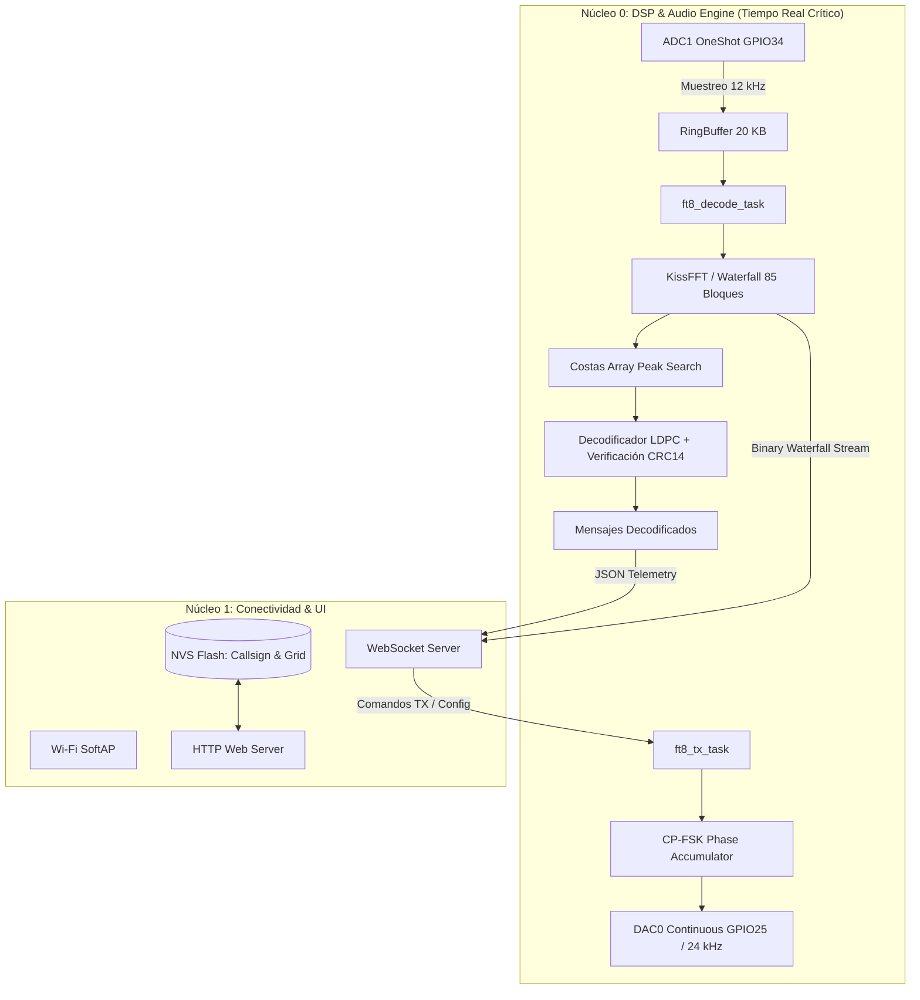

# ⚡ Sistemas Embebidos — Portafolio de Prácticas & Proyecto Final

[](LICENSE)
[](https://www.uns.edu.ar/)
[](https://cs.uns.edu.ar/)
[](https://isocpp.org/)
[](https://en.wikipedia.org/wiki/Verilog)
[](https://www.freertos.org/)
[](https://platformio.org/)
[](https://www.intel.com/content/www/us/en/software/programmable/quartus-prime/overview.html)
[](https://docs.espressif.com/projects/esp-idf/)

Este repositorio reúne el trabajo práctico, laboratorios experimentales y el proyecto final desarrollados para la cátedra **Sistemas Embebidos (2025)** del _Departamento de Ciencias e Ingeniería de la Computación (DCIC)_ en la **Universidad Nacional del Sur (UNS)**.

El contenido abarca desde el control de hardware a bajo nivel sobre microcontroladores de 8 bits (AVR), diseño de arquitectura de firmware desacoplada por eventos y sistemas operativos de tiempo real (RTOS), hasta diseño de hardware digital reconfigurable en FPGA (Verilog/SoPC) y procesamiento digital de señales (DSP) en sistemas de 32 bits dual-core.

---

## 🧭 Índice de Laboratorios y Proyectos

|                                Módulo / Práctica                                 | Plataforma & Hardware                       | Conceptos Clave & Tecnologías                                                                                                                                                                               |
| :------------------------------------------------------------------------------: | :------------------------------------------ | :---------------------------------------------------------------------------------------------------------------------------------------------------------------------------------------------------------- | :----------------------------------------------------------------------------------: |
|             [**GPIO, Temporización & UART**](01_GPIO_Temporizadores)             | ATmega328P (Arduino Uno)                    | Entradas/salidas digitales, eliminación de rebotes (debouncing), retardos no bloqueantes, detección de flancos, comunicación serie asincrónica.                                                             |
|      [**Drivers Modulares & Colas de Eventos**](02_Drivers_Mecanismos_Sync)      | ATmega328P + LCD Keypad Shield              | Capa de abstracción de hardware (HAL), secciones críticas atómicas, colas circulares de funciones (_Function Queue_), máquinas de estados para teclado analógico y cronómetro.                              |
|     [**Driver ADC por Interrupciones & GUI Host**](03_ADC_SensorLuminosidad)     | ATmega328P + Sensor LDR + Processing        | Muestreo analógico no bloqueante por interrupción de ADC, búfer circular para estadísticas en tiempo real (mín/máx/promedio), protocolo UART bidireccional y dashboard en Processing.                       |
|  [**Comunicación I2C Distribuida (Master-Slave)**](04_I2C_RaspberryPi_Arduino)   | Raspberry Pi 3B+ (Master) + Arduino (Slave) | Protocolo binario de longitud variable con enmarcado por delimitadores (`0x7E`/`0x7F`) y _byte-stuffing_ (secuencias de escape), driver I2C en Linux con `pigpio` y app de consola en C++.                  |
|     [**Sistemas Operativos de Tiempo Real (RTOS)**](05_FreeRTOS_Multitarea)      | ATmega328P + FreeRTOS                       | Planificación concurrente basada en prioridades, sincronización de tareas con semáforos, gestión de estados (Running, Ready, Blocked), colas de mensajes y temporizadores por software (_Software Timers_). |
|     [**Hardware Reconfigurable FPGA & SoPC Nios II**](06_FPGA_Verilog_SoPC)      | Altera Cyclone V (DE1-SoC)                  | Síntesis RTL en Verilog, multiplexores con IPs `LPM_MUX`, red combinacional de ordenamiento en paralelo de 4 valores de 8 bits (_Sorter4_), integración de procesador soft-core Nios II Gen2 y HAL/no-HAL.  |
| ⭐ [**Proyecto Final: Módem FT8 Autónomo (MAP-FT8)**](07_ProyectoFinal_ModemFT8) | Espressif ESP32 Dual-Core (240 MHz)         | Procesamiento Digital de Señales (DSP), KissFFT, matrices Costas, decodificación LDPC + CRC14, modulación continua CP-FSK, FreeRTOS, servidor web embebido y WebSockets.                                    | [🔗 Repositorio Oficial](https://github.com/ManuT18/SistemasEmbebidos_ProyectoFinal) |

---

## 🌟 Proyecto Final Destacado: MAP-FT8 (Módem FT8 Autónomo en ESP32)

> **Repositorio independiente:** [ManuT18/SistemasEmbebidos_ProyectoFinal](https://github.com/ManuT18/SistemasEmbebidos_ProyectoFinal)

### 📻 ¿Qué es MAP-FT8?

**MAP-FT8** es un módem autónomo y portable para comunicaciones digitales de radioafición en el protocolo **FT8**. Elimina la necesidad de computadoras personales pesadas en expediciones de campo (SOTA/POTA): el dispositivo se conecta directamente a la radio, procesa el audio en tiempo real y ofrece una **interfaz web con cascada espectral (_waterfall_) y control remoto vía Wi-Fi** desde cualquier teléfono celular o tablet.

```text
 ┌─────────────────┐       Audio RX (ADC)       ┌────────────────────────┐       Wi-Fi AP       ┌────────────────────────┐
 │ Transceptor HF  │ ─────────────────────────► │      ESP32 SoC         │ ◄──────────────────► │ Teléfono / Tablet / PC │
 │ (Radioafición)  │ ◄───────────────────────── │ (DSP + FreeRTOS + Web) │     (WebSockets)     │ (Waterfall & Control)  │
 └─────────────────┘       Audio TX (DAC)       └────────────────────────┘                      └────────────────────────┘
```

### 🧠 Arquitectura de Procesamiento y Firmware

El sistema aprovecha la arquitectura de doble núcleo del ESP32 para garantizar determinismo estricto de tiempo real sin descuidar la conectividad de red:



### 🔬 Aspectos Técnicos Destacados de MAP-FT8

- **DSP en Tiempo Real:** Análisis espectral por bloques de 160 ms (1920 muestras a 12 kHz) con ventana Hanning y algoritmo KissFFT.
- **Detección y Corrección de Errores:** Búsqueda de hasta 20 señales candidatas simultáneas mediante correlación con secuencias Costas, demodulación de 79 símbolos de 8 tonos (6.25 Hz de espaciado) y decodificación por propagación de creencias LDPC (174,91).
- **Transmisión de Fase Continua (CP-FSK):** Generador de tonos por acumulador de fase sin discontinuidades, sobremuestreo a 24 kHz y salida analógica por el DAC continuo interno.
- **Resolución de Conflictos de Hardware:** Solución a la limitación interna de recursos I2S0 en ESP32 desacoplando el ADC mediante muestreo OneShot temporizado con `esp_timer` y buffers circulares libres de bloqueo (_lock-free_).
- **Sincronización Temporal de Ranuras (Slots):** Temporización estricta para intervalos estándar de 15 segundos con compensación de latencia de hardware.

---

## 🛠️ Herramientas y Entornos de Desarrollo

- **Firmware & Embebidos:** PlatformIO IDE, ESP-IDF (v5.x), AVR-GCC, Make / CMake.
- **Hardware Reconfigurable:** Intel / Altera Quartus Prime Lite Edition, Platform Designer (Qsys), ModelSim.
- **SBCs & Herramientas Linux:** Raspberry Pi OS, pigpio library, SSH, Git.
- **Interfaces Host:** Processing 4 (Java-based UI), WebSockets, HTML5 / Canvas / JavaScript.

---

## 📥 Clonación y Configuración del Repositorio

Dado que el **Proyecto Final (07_ProyectoFinal_ModemFT8)** está vinculado como un submódulo Git, se recomienda clonar con la bandera `--recurse-submodules`:

```bash
# Clonar el repositorio completo incluyendo el submódulo del Proyecto Final
git clone --recurse-submodules https://github.com/ManuT18/Sistemas-Embebidos.git

# Si ya se clonó sin la bandera, inicializar y actualizar los submódulos:
git submodule update --init --recursive
```

---

## 👨‍💻 Autores & Contacto

- **Manuel Tauro** — Estudiante de Ingeniería en Computación (UNS)
  - GitHub: [@ManuT18](https://github.com/ManuT18)
  - Repositorio del Proyecto Final: [ManuT18/SistemasEmbebidos_ProyectoFinal](https://github.com/ManuT18/SistemasEmbebidos_ProyectoFinal)
- **Gonzalo Aguirre** — Co-autor de prácticas y proyecto final
