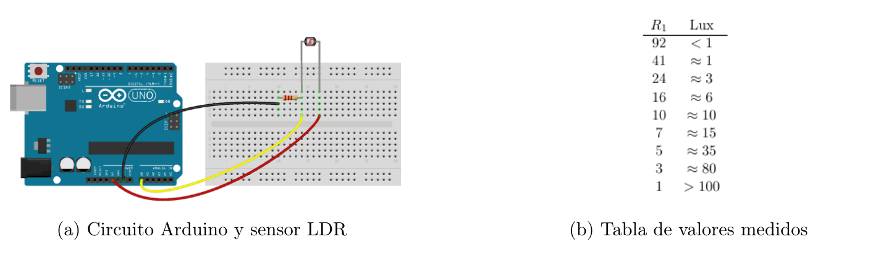

# Sistemas Embebidos

```
Departamento de Ciencias e Ingeniería de la Computación
Universidad Nacional del Sur
Segundo Cuatrimestre de 2025
```
## Laboratorio N◦ 3

```
Conversor Analógico Digital
```
Fecha de entrega: Viernes 03/10/25


## Entregables

* Código fuente dentro de `src/`
* Un informe **conciso** (lo mínimo solicitado) y **completo** (lo que necesita
  la cátedra saber sobre el proyecto para compilarlo y cargarlo, y comentarios
  adicionales que sean *importantes* sobre la entrega), almacenado en
  `doc/informe.md`.
    * Especifique la estructura de diseño y la capacidad de leer de varios
      canales del sistema pedido en el punto 1 de la actividad 1.
    * Función para convertir cada valor digitalizado, frecuencia de muestro,
      tareas del sistema y eventos en el punto 2 de la actividad 1. Añada toda
      decisión o limitación de diseño que considere relevante.


# Actividad 1: Sensor digital de luminosidad

Utilizando el protoboard, el sensor LDR, resistencia de 1K ohms y placa Arduino se desea
implementar un sensor digital de luminosidad como se indica en la figura 1a

 
```
(a) Circuito Arduino y sensor LDR (b) Tabla de valores medidos
```
```
Figura 1: Diagrama del circuito y tabla de valores medidos.
```
1. Implementar un driver de ADC, que provea la siguiente función de inicialización

```
bool adc_init(adc_cfg *cfg): Función que inicializa el driver de ADC y acepta como
parámetro una estructura de tipo adc_cfg.
```

```
La estructura adc_cfg tiene que tener un campo que selecciona el canal a configurar, y
una función de callback que será invocada cuando se haya completado la conversión de
un valor. Se puede añadir cualquier otro campo que se considere necesario.
Esta función inicializará el ADC del ATMega328P en el modo de operación más conve-
niente para la aplicación (ver [1]) y asociará el canal seleccionado con su callback cada
vez que sea invocada, retornando 1 si la configuración resultase exitosa, o 0 en caso de
producirse un fallo en la inicialización o configuración.
```
```
El driver debe ser capaz de recibir más de un llamado a la función adc_init, con distinta
selección de canal, y ser capaz de asociar a cada canal su función callback, invocándola cuando
una conversión de ese canal esté completa.
El driver debe estar escrito en archivos independientes al programa principal, con la imple-
mentación escrita en un archivo .c/.cpp, y su interfaz pública declarada en un archivo header
(.h).
Para obtener el resultado de la conversión del ADC, el driver debe valerse de la interrupción
provista por el periférico.
```
2. A partir del voltaje obtenido del sensor, se deberá poder convertir dicha cantidad a un valor
    de LUX mediante el driver de ADC.
    El sistema deberá registrar en LUX la luminosidad actual, y a partir de ella, registrar las lumi-
    nosidades mínima y máxima desde el inicio de la ejecución del sistema. Utilizando el driver
    de TECLADO del laboratorio anterior se deberá poder seleccionar qué luminosidad se visualiza
    (actual, máxima, mínima o promedio). El rango de luminosidades podrá variar dinámicamente
    ya que el sistema deberá adaptarse a cambios en las condiciones de iluminación ambiente. El
    sistema también deberá calcular durante un período de tiempo determinado la lumininosidad
    promedio en LUX y como porcentaje del rango mínimo-máximo. Para ello se espera que el
    sistema conserve un arreglo circular con las útlimas 200 muestras tomadas a lo largo de los
    últimos 15 segundos
    En base al valor de voltaje entregado por el sensor y al voltaje de referencia utilizado por el
    ADC, determine la función para convertir cada valor digitalizado al valor correspondiente de
    luminosidad (en Lux). Para la conversión tenga en cuenta la estructura del circuito presentado
    en la figura 2, y la tabla 1 (la cual se deberá interpolar linealmente) que mapea valores de la
    resistencia R1 del LDR a valores de luminosidad medidos en Lux:
    Para el sistema tenga en cuenta las siguientes consideracion de diseño:

```
En base al valor de voltaje entregado por el sensor y al voltaje de referencia utilizado
por el ADC, determine la función para convertir cada valor digitalizado en el valor de
lumininosidad correspondiente en C. Incluya los cálculos realizados.
Estime la frecuencia de muestreo necesaria para obtener los valores utilizados en el cálculo
de la luminosidad promedio.
Identifique las tareas del sistema e indique para cada una los dispositivos asociados
(display, pulsadores, ADC, etc)
Determine los eventos que iniciarán la ejecución de cada una de las tareas identificadas.
```

# Actividad 2: Interface de control sensor digital de luminosidad

1. Se desea incorporar al Sensor Digital de luminosidad realizado en la actividad anterior una
    aplicación en el host que:

```
Permita graficar los valores de luminosidad obtenidos (actual, máxima, mínima, y pro-
medio) durante el último minuto de ejecución del sistema
Muestre los valores numéricos de las cuatro lumininosidades obtenidas (actual, máxima,
mínima y promedio).
Provea al usuario de botones que le permitan cambiar el modo de operación del sensor
(para seleccionar qué lumininosidad se visualiza por el display LCD del mismo), permi-
tiendo ejercer el control del sensor desde el host.
```
```
Para ello se requiere modificar el sistema implementado en el laboratorio anterior, añadién-
dole la capacidad de comunicarse con el host de manera asincrónica mediante la UART del
ATmega328P, apelando a la librería Arduino Serial.
Adicionalmente, se requiere la implementación de una aplicación en el host que realice las
tareas indicadas anteriormente. Para simplificar esta parte del proyecto, se provee un ejemplo
realizado en el lenguaje Processing [7].
El ejemplo dispone de la mayor parte de la funcionalidad para la interface de control ya
implementada, y se espera que los alumnos lo modifiquen adaptando la funcionalidad existente
e incorporando la funcionalidad faltante.
Si alguna comisión considera utilizar otra plataforma de desarrollo para la aplicación host,
podrá implementar esta parte del proyecto siempre que la plataforma elegida ofrezca la fun-
cionalidad gráfica y permita realizar comunicación través de los puertos serie de la PC.
En base a la descripción dada previamente
```
```
a) Estudie y familiarícese con la librería Serial [2] de Arduino.
b) Estudie y familiarícese con la librería Serial [3] de Processing.
c) Descargue y abra el ejemplo “SE_Lab_HostTempApp” [4] de Processing disponible en
moodle. Examine el código del ejemplo y familiarícese con el funcionamiento del mismo.
d) Describa las modificaciones a realizar en la aplicación desarrollada en la actividad anterior
para incorporar la capacidad de realizar comunicación bidireccional en serie asincrónica.
Añada la descripción de las tareas incorporadas para tal fin. Indique qué eventos des-
encadenan la ejecución de dichas tareas y qué cambios, si existen, deben producirse en
la estructura de control del sensor como consecuencia de su incorporación (por ejemplo,
manejo de mensajes entrantes, manejo de mensajes salientes, etc).
e) Describa brevemente las modificaciones a realizar sobre el ejemplo para adaptarlo a los
requerimientos del laboratorio.
f ) Implemente las modificaciones planteadas precedentemente.
```
# Referencias

[1] Atmel AVR ATmega48A/48PA/88A/88PA/168A/168PA/328/328P Data Sheet.

[2] Libreria “Serial” para Arduino. [http://arduino.cc/en/Reference/Serial.](http://arduino.cc/en/Reference/Serial.)


[3] Biblioteca “Serial” de Processing. [http://processing.org/reference/libraries/serial/index.html.](http://processing.org/reference/libraries/serial/index.html.)

[4] Ejemplo “SE_Lab_HostTempApp” disponible en la pagina web de la materia.

[5] https://components101.com/sites/default/files/component_datasheet/LDR_Datasheet.pdf.@sV
